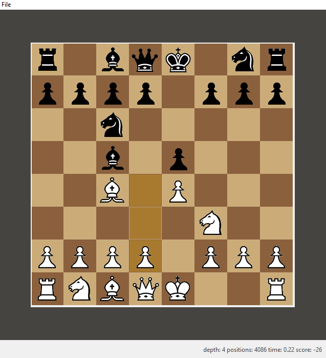

# Python Chess Engine with GUI

### Introduction
A simple, but relatively powerful alphabeta chess engine that implements a custom graphical user interface built using Python's Tkinter. It employs all advanced chess rules such as pinning, castling, and en passant. To encourage diversity of moves, it contains a database of over <strong>3000 openings</strong> which the computer will pick at random everytime a new game is played.

Against the computer on <a href="https://lichess.org/">lichess.org</a>, it fares well against a bot ranked <strong>1700</strong> in rating.

In order to tinker with the engine and suit it to your needs, the piece values and piece square tables can be adjusted.

To start a new game, you simply have to click on <i>File</i> and you can choose whether to start as white or black.

### Features

1. A fullly functional graphical user interface in Tkinter that handles user inputs in an organized manner.
2. Wrangles a tab-separated file into a format that the engine can use.
3. A simple, iterative deepening search to filter out the best move.

### Limitations

This engine still lacks some chess rules, such as the 50 moves draw rule and stalemate.

In addition, the search and evaluation function does little to no pruning whatsoever. This causes the bot to search way too many unnecessary positions, resulting in an average time of 5 seconds to search to a depth of 5.

## Lisense

<a href="https://www.gnu.org/licenses/gpl-3.0.en.html">GNU GPL v3</a>
